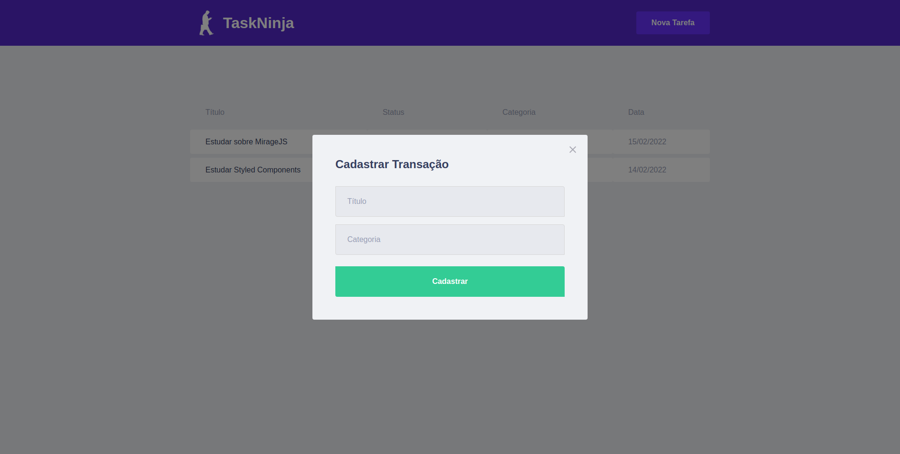

# Ebytr Challenge

> Live demo at [_Vercel_](https://www.example.com).

## Table of Contents

* [General Info](#general-information)
* [Technologies Used](#technologies-used)
* [Features](#features)
* [Screenshots](#screenshots)
* [Setup](#setup)
* [Usage](#usage)
* [Project Status](#project-status)
* [Room for Improvement](#room-for-improvement)
* [Acknowledgements](#acknowledgements)
* [Contact](#contact)
* [License](#license)

## General Information
### What problem does the project intend to solve?

The Ebytr company is experiencing productivity/control problems because the collaborating people have been having difficulty in organizing their individual tasks. For this reason, product director Carolina Bigonha decided to implement a new way of organizing tasks.
You were the person hired to develop a system capable of helping collaborating people get organized and be more productive.
At Ebytr the development team uses Stack __MERN__ to create their applications. It was agreed with Ebytr that you will use this same Stack to solve the organization and productivity problem of the company.

### What is the purpose of the project?

This project was a challenge promoted by [Trybe](https://www.betrybe.com) as a mean to prepare its students to technical challenges when applying to jobs in tech companies. Not only we were expected to perform in accordance to the technical requirements of this challenge, but also be prepared to be interviewed by recruiters asking about the know-hows and whys of our solutions.

### Why did I undertake it?

At [Trybe](https://www.betrybe.com), I was mostly studying(and struggling) to understand backend technologies with __NodeJS__ and other tools like __Sequelize__ and __Socket.io__. This challenge came at a time when I was still reviewing frontend technologies like __React__ and __Vue__, for example, and learning to construct websites using __TypeScript__.

Knowing that I had (and still have) long ways to go to work easily in frontend, I still accepted the challenge where I could get better at for the foreseeable future and add improvements to my current capabilities.

### Technical Requirements

1. Front-End done with __React__;
2. Back-End done with __NodeJS__ and __MongoDB__;
3. Use __layered architecture__ (MSC or MVC);

## Technologies Used

- [NPM](https://www.npmjs.com) - ```^8.1.2```
- [Node](https://nodejs.org/en/) - ```^16.13.2```
- [React](https://reactjs.org) - ```^17.0.2```
- [Styled Components](https://styled-components.com) - ```^5.3.3```
- [MirageJS](https://miragejs.com) - ```^0.1.43```
- [Vercel](https://vercel.com)

## Features

- Add new ToDos with Modal;
- List all registered ToDos;
- Sort ToDos List by title.


## Screenshots

<div style="width: 60%; margin: 0 auto; text-align: center; font-style: italic;">
  
  <p>Screenshot 1</p>
  
  <p>Screenshot 2</p>
</div>

<div style="width: 60%; margin: 0 auto; text-align: center; font-style: italic;">
  
  <p>Screenshot 3</p>
  
  <p>Screenshot 4</p>
</div>

## Setup

Clone the project from Github :

__SSH Method__

```sh
$ git clone git@github.com:noel-srocha/ebytr-challenge.git
$ cd ebytr-challenge
```

__HTTPS Method__

```sh
$ git clone https://github.com/noel-srocha/ebytr-challenge.git
$ cd ebytr-challenge
```

Once inside the project\'s root folder, paste the following code to your terminal:

```sh
$ npm install
```

## Usage

How does one go about using it?
Provide various use cases and code examples here.

While in development, after installing all dependencies, start by launching the app on localhost by type the following command in your terminal (be mindful that you must be at the project\'s root folder):

```sh
$ npm start
```

This will let you observe how the app behaves on the browser.

### Contributing

If you wish to make modifications and contribute to the project, paste the following command to your terminal:

```sh
$ git checkout development
```

This will change the current branch of the repository to the one reserved for development of new features and chores. If you would like to add new branchs according to your goals, simply:

```sh
$ git checkout -b {branchName}
```

After making your modifications, follow the instructions below:

```sh
git add [files-you-modified-/-created-/-deleted]
git commit -m "Tell me what you did"
git push # or git push -u origin {branchName} in case you created a new branch
```

This will create a Pull Request in this repository where it will be analyzed and, if approved, merged to the main branch.

## Project Status

Project is: _archived for later development_. Currently, I'm migrating towards TypeScript projects, so I can better familiarize with the language and then learn new frontend technologies to better improve my workflow and create websites seamlessly.


## Improvements Needed

Room for improvement:

- Make a true backend to store tasks and serve data back to the frontend;
- Add features like task completion, priority configuration, notifications by email and others;
- Build a better stylization to give an authentic feel to the website.

To do:

- Build tests to provide security to the application;
- Add true backend with NodeJS and MongoDB using Mongoose;
- Make slight adjustments to the styling.

## Acknowledgements

- This project was inspired by [Trybe](https://www.betrybe.com)
- Many thanks to [Rocketseat](https://www.rocketseat.com.br) for providing the lessons needed to give this challenge a go!

## Contact

Created by [Manoel de Souza Rocha Neto](https://www.linkedin.com/in/devmanoelrochaneto/) - feel free to contact me!

## License

This project is open source and available under the __MIT License__.